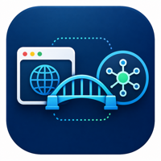

<p align="center">
  
</p>

<h1 align="center">CDP Bridge MCP</h1>

<div align="center">

[](https://pypi.org/project/cdp-bridge/)
[](https://www.python.org/)
[](https://modelcontextprotocol.io/)
[](https://github.com/Unagi-cq/cdp-bridge-mcp)

</div>

<p align="center">
CDP Bridge MCP is a bridge service that connects MCP clients to real browser sessions. Through its companion Chromium extension, model clients can access browser pages, list tabs, scan page content, execute JavaScript, capture screenshots, navigate pages, and read cookies.
</p>

<p align="center">
<a href="../README.md">中文</a> | English
</p>

## Demo Videos

<table>
  <tr>
    <td width="50%">
      <iframe src="//player.bilibili.com/player.html?isOutside=true&aid=116543333670350&bvid=BV1RDRQBrEY7&cid=38208012791&p=1" scrolling="no" border="0" frameborder="no" framespacing="0" allowfullscreen="true"></iframe>
    </td>
    <td width="50%">
      <iframe src="//player.bilibili.com/player.html?isOutside=true&aid=116543333670350&bvid=BV1RDRQBrEY7&cid=38208012791&p=1" scrolling="no" border="0" frameborder="no" framespacing="0" allowfullscreen="true"></iframe>
    </td>
  </tr>
</table>

# Introduction

CDP Bridge MCP is designed for scenarios where large language models need to work with a real browser. **Unlike stateless HTTP fetching, it connects to browser pages that are already open and already logged in, so it can reuse the browser's login state, cookies, page state, and rendered frontend result.**

Repository: <https://github.com/Unagi-cq/cdp-bridge-mcp>

> This project is written and distributed in Python.

## Why CDP Bridge MCP?

**Why use CDP Bridge MCP instead of Playwright MCP or Chrome DevTools MCP?**

Playwright MCP and Chrome DevTools MCP are both powerful, but they are more oriented toward workflows such as automated testing, debugging protocols, or newly launched browser instances. CDP Bridge MCP has a different goal: it focuses on letting an LLM directly work with the real browser session you are already using.

- **Reuse real login state**: CDP Bridge MCP connects to browser tabs that are already open and logged in. It can directly use existing cookies, login state, page context, and rendered frontend output. For many account-based websites, there is no need to log in again or manually transfer cookies.
- **Better for everyday browser collaboration**: Playwright is a strong fit for repeatable and scriptable automation workflows. CDP Bridge MCP is better suited for interactive tasks on the user's current page, such as reading, analyzing, checking before clicking, executing scripts, and taking screenshots.
- **Page content is optimized for LLMs**: `browser_scan` simplifies page HTML by filtering scripts, styles, and invisible elements while keeping useful text, controls, and structure, reducing token waste.
- **Lightweight startup flow**: Once published to PyPI, the server can be started with `uvx cdp-bridge`. The browser side only needs the extension to be loaded. There is no need to write Playwright scripts or configure debug parameters for each browser instance.

If your goal is to let a model control a dedicated automation browser, Playwright MCP is a good fit. If your goal is to debug Chrome or work closely with the DevTools protocol, Chrome DevTools MCP is a good fit. If your goal is to let a model read and operate on the real browser page you are currently using, CDP Bridge MCP is closer to that scenario.

## Available Tools

The MCP server currently exposes these tools:

| Tool | Description |
| --- | --- |
| `browser_get_tabs` | Get the list of connected browser tabs |
| `browser_scan` | Scan the active page as simplified HTML or plain text |
| `browser_execute_js` | Execute JavaScript in the active tab |
| `browser_switch_tab` | Switch the active tab |
| `browser_navigate` | Navigate the active tab to a URL |
| `browser_screenshot` | Capture a page screenshot |
| `browser_cookies` | Read cookies |
| `browser_get_sop` | Read a bundled SOP. Supported values: `tmwebdriver` and `vue3_component`. The model should load it when CDP commands, iframes, screenshots, cookies, downloads, autofill, file upload, or Vue 3 custom components need task-specific guidance; if the relevant SOP was already loaded in the same task, it should not be loaded again |

# Usage

## Installation Steps

1. Load the browser extension folder `src/cdp_bridge/tmwd_cdp_bridge` into Chrome or another Chromium-based browser.
2. Configure CDP Bridge MCP in your MCP client.

After that, the MCP server can be used normally. The detailed steps are listed below.

## Load the Browser Extension

In Chrome or another Chromium-based browser:

1. Open `chrome://extensions/`.
2. Enable "Developer mode".
3. Click "Load unpacked".
4. Select the `src/cdp_bridge/tmwd_cdp_bridge` folder.

By default, the extension connects to the local service at `127.0.0.1:18765`.

## Configure MCP

First, install `uv` on your computer.

> `uvx` was officially introduced in uv 0.2.0. If your uv version is lower than 0.2.0, the `uvx` command may not be available. In older versions, similar functionality can be used through `uv tool run`, which is also the underlying behavior of `uvx`.

### Script Test

```bash
uvx cdp-bridge # uv >= 0.2.0
uv tool run # uv < 0.2.0
```

### Standard Configuration

You can configure it in an MCP client like this:

```json
{
  "mcpServers": {
    "cdp-bridge": {
      "command": "uvx",
      "args": ["cdp-bridge"]
    }
  }
}
```

### Claude Code

```bash
claude mcp add cdp-bridge uvx cdp-bridge
```

### Codex

```bash
codex mcp add cdp-bridge uvx cdp-bridge
```

### opencode

Configure it in `~/.config/opencode/opencode.json`:

```json
{
  "$schema": "https://opencode.ai/config.json",
  "mcp": {
    "cdp-bridge": {
      "type": "local",
      "command": [
        "uvx",
        "cdp-bridge"
      ],
      "enabled": true
    }
  }
}
```

### OpenClaw

You can write the MCP configuration with the OpenClaw CLI:

```bash
openclaw mcp set cdp-bridge '{"command":"uvx","args":["cdp-bridge@latest"]}'
```

Equivalent configuration shape:

```json
{
  "mcp": {
    "servers": {
      "cdp-bridge": {
        "command": "uvx",
        "args": ["cdp-bridge@latest"]
      }
    }
  }
}
```

### Notes

- This project requires Python 3.10 or newer.
- The browser extension and MCP server must run at the same time. Otherwise, the tools will report that no browser tabs are connected.
- Browser automation runs in your real browser session, so only connect MCP clients that you trust.

## Acknowledgements

The browser extension and parts of the code in this project are based on and adapted from [GenericAgent](https://github.com/lsdefine/GenericAgent). Thanks to the original author for the open-source work.
